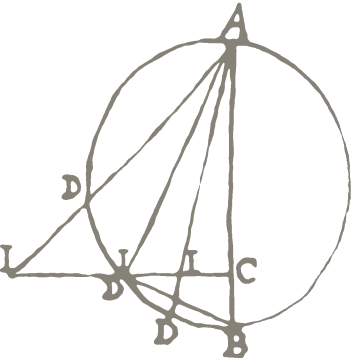

<!-- Improved compatibility of back to top link: See: https://github.com/othneildrew/Best-README-Template/pull/73 -->

<!--
*** Thanks for checking out the Best-README-Template. If you have a suggestion
*** that would make this better, please fork the repo and create a pull request
*** or simply open an issue with the tag "enhancement".
*** Don't forget to give the project a star!
*** Thanks again! Now go create something AMAZING! :D
-->

<!-- PROJECT SHIELDS -->
<!--
*** I'm using markdown "reference style" links for readability.
*** Reference links are enclosed in brackets [ ] instead of parentheses ( ).
*** See the bottom of this document for the declaration of the reference variables
*** for contributors-url, forks-url, etc. This is an optional, concise syntax you may use.
*** https://www.markdownguide.org/basic-syntax/#reference-style-links
-->
<!-- [![Contributors][contributors-shield]][contributors-url]
[![Forks][forks-shield]][forks-url]
[![Stargazers][stars-shield]][stars-url]
[![Issues][issues-shield]][issues-url]
[![MIT License][license-shield]][license-url]
[![LinkedIn][linkedin-shield]][linkedin-url] -->

<!-- PROJECT LOGO -->
 

  

  <h3 align="center">Digital Infrastructure for the Humanities (DRIH)</h3>

  <!-- 

    An awesome README template to jumpstart your projects!
     
    <a href="https://github.com/othneildrew/Best-README-Template"><strong>Explore the docs »</strong></a>
     
     
    <a href="https://github.com/othneildrew/Best-README-Template">View Demo</a>
    ·
    <a href="https://github.com/othneildrew/Best-README-Template/issues">Report Bug</a>
    ·
    <a href="https://github.com/othneildrew/Best-README-Template/issues">Request Feature</a>
  

 -->

<!-- TABLE OF CONTENTS -->

  
Table of Contents

  <ol>
    <li>
      <a href="#about-the-project">About The Project</a>
    </li>
    <li>
      <a href="#ingestor-scripts">Ingestor Scripts</a>
    </li>
    <li><a href="#project-description-layer-model">Project Description Layer Model (PDLM) v.0.1</a></li>
    <li><a href="#pdlm-tabular-data">Tabular data of the PDLM v.0.1</a></li>
    <li><a href="#license">License</a></li>
    <li><a href="#contact">Contact</a></li>
    <li><a href="#acknowledgments">Acknowledgments</a></li>
  </ol>

<!-- ABOUT THE PROJECT -->
## About The Project

<!-- We could add a DRIH screenshot here? -->
<!-- [![Product Name Screen Shot][product-screenshot]](https://example.com) -->

In view of the steadily growing volume of digital output from Humanities research projects in recent decades, the question of the long-term and sustainable preservation of this research data is becoming increasingly urgent. To meet this challenge, we are establishing the Central Knowledge Graph (CKG) as a key element of our documentation and publication strategy for research data. In this paper, we present two of the cornerstones of this strategy: The newly developed Project Description Layer Model (PDLM) provides the means to document the required contextual metadata about research projects and their digital outputs; the Zellij Semantic Documentation Protocol systematically documents the modeling patterns used to create CIDOC CRM representations of project data in a transparent and reusable way. We highlight how we developed and documented our models and present a case study to showcase its expressivity, as well as its real-world potential in saving legacy data at the Max Planck Institute for the History of Science.

<!-- GETTING STARTED -->
## Ingestor scripts

Insert a few lines here about the ingestor scripts - prerequisits and installations and libraries. and mabye a short explanation

### Prerequisites
placeholder

### Installation
placeholder

<!-- USAGE EXAMPLES -->
## Project Decsription Layer Model

The Project Description Layer Model (PDLM) is a semantic model derived from CIDOC CRM, designed to describe research projects and their digital outputs within an institutional research data management strategy. Utilizing concepts from the Parthenos Entities Model (PEM), the PDLM emphasizes entities like digital objects (such as datasets and software), activities (including research and service projects), and actors (individuals, groups, and project teams). Digital objects are categorized into datasets and software, with distinctions made between volatile and persistent forms, crucial for archival purposes and data reuse. Activities encompass research and service projects, with detailed documentation of digital machine events for tracking the creation context of digital objects. Actors, comprising project teams, groups, and individuals, are essential for establishing the contextual framework. Developed using the Zellij Semantic Documentation Protocol, the PDLM serves as a core model for contextualizing projects and their digital outputs, forming a vital part of the institution's Collective Knowledge Graph (CKG) alongside CIDOC CRM representations, contributing to sustainable research data management.

<!-- ROADMAP -->
## PDLM tabular data

Placeholder

<!-- LICENSE -->
## License

Distributed under the CC0 1.0 Universal. See `LICENSE.txt` for more information.

<!-- CONTACT -->
## Contact

Your Name - [@your_twitter](https://twitter.com/your_username) - email@example.com

Project Link: [https://github.com/your_username/repo_name](https://github.com/your_username/repo_name)

<!-- ACKNOWLEDGMENTS -->
## Acknowledgments
placeholder

